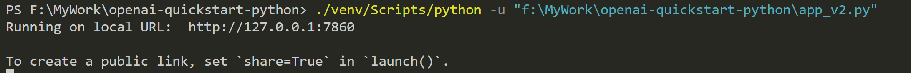
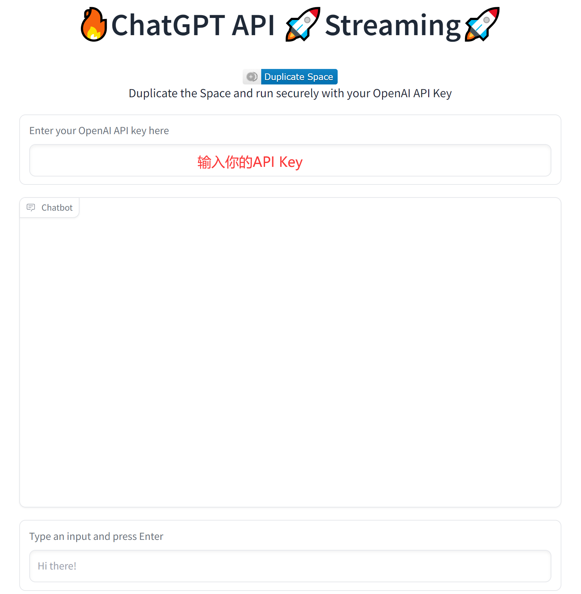

# 调用OpenAI的ChatGPT接口


## 具体步骤

1. 安装python

2. 克隆这个仓库, 安装对应的包

```bash
pip install openai
pip install gradio
```

3. 去官方网站获取你的 [API key](https://beta.openai.com/account/api-keys)

4. 执行python文件

   ```bash
   $ python app_v2.py
   ```

5. 打开对应的网站，就可以进行愉快的对话拉



